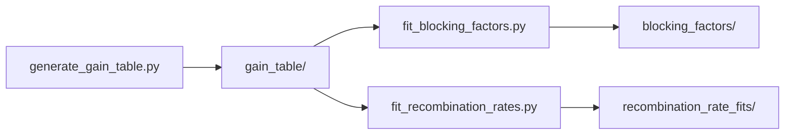

# QD-DFB gain-spectrum model

Computes the material gain spectrum of a quantum-dot (QD) distributed-feedback
(DFB) laser as a function of injection current, by numerically integrating
the multi-level electron/hole rate-equation model of

> Gioannini & Rossetti, "Time-Domain Traveling Wave Model of Quantum Dot DFB
> Lasers," *IEEE J. Sel. Top. Quantum Electron.*, Vol. 17, No. 5, 2011.

The resulting gain-vs-carrier-density-vs-wavelength table, and the fitted
Pauli-blocking-factor expressions described below, are what get fed into
PICWave's material-model importer, since PICWave itself cannot solve the
underlying multi-level QD rate equations. This repository covers only that
model-generation step — the PICWave-facing import/export code and the
downstream result-plotting scripts live elsewhere.

## Pipeline

Three stages, run in order, all reading from the same rate-equation
simulation cache:



1. **Gain spectrum** (`generate_gain_table.py`, using `qd_gain/`) — sweeps
   injection current, integrates the rate equations to convergence at each
   point, caches the result to `gain_table/`, and computes the material gain
   spectrum from it.
2. **Pauli-blocking factors** (`fit_blocking_factors.py`, using
   `pauli_blocking/`) — reloads `gain_table/` and fits each level's
   occupation probability against a neighbouring level's population,
   writing PICWave-ready expressions to `blocking_factors/`.
3. **Recombination rates** (`fit_recombination_rates.py`, using
   `recombination_rates/`) — reloads `gain_table/` and fits the total Auger
   and spontaneous-emission rates against total electron density, writing
   PICWave-ready expressions to `recombination_rate_fits/`.

Stages 2 and 3 are independent of each other (both only depend on stage 1)
and share their general fitting machinery via `pauli_blocking/curve_fitting.py`
rather than each carrying their own copy — see
[Pauli-blocking-factor fitting](#pauli-blocking-factor-fitting) and
[Recombination-rate fitting](#recombination-rate-fitting).

## Layout

```
qd_gain/
    parameters.py
    carrier_dynamics.py
    gain_model.py
generate_gain_table.py
gain_table/
pauli_blocking/
    data.py
    curve_fitting.py
fit_blocking_factors.py
blocking_factors/
recombination_rates/
    data.py
    curve_fitting_rise.py
fit_recombination_rates.py
recombination_rate_fits/
```

| Path | Contents |
| --- | --- |
| `qd_gain/parameters.py` | Physical constants, material/device parameters, and every default/fitted numeric value used below |
| `qd_gain/carrier_dynamics.py` | Charge-neutrality/Fermi-occupation helpers and `run_qd_simulation()`, the rate-equation integrator |
| `qd_gain/gain_model.py` | `gain()`, `gain_index()`, `compute_gain_spectrum()`, `compute_occupation_probabilities()`, `compute_recombination_rates()`, and `refractive_index_change()` |
| `generate_gain_table.py` | Entry point: builds the current-density sweep, runs the simulation, caches results, plots spectra |
| `gain_table/` | Cached simulation output (see [Caching](#caching)) |
| `pauli_blocking/data.py` | Loads `gain_table/` into per-current occupation probabilities/populations |
| `pauli_blocking/curve_fitting.py` | General single-curve and piecewise curve-fitting utilities (falling saturating curves), with PICWave-expression output |
| `fit_blocking_factors.py` | Entry point: fits each level's Pauli-blocking factor vs. a neighbouring level's population (see [Pauli-blocking-factor fitting](#pauli-blocking-factor-fitting)) |
| `blocking_factors/` | Fitted blocking-factor plots and PICWave expressions, one folder per transition |
| `recombination_rates/data.py` | Loads `gain_table/` into per-current total electron density and Auger/spontaneous rates |
| `recombination_rates/curve_fitting_rise.py` | Single-curve and piecewise curve-fitting for *rising* saturating curves (mirror image of `pauli_blocking/curve_fitting.py`; reuses its registry-agnostic helpers) |
| `fit_recombination_rates.py` | Entry point: fits total Auger and spontaneous rates vs. total electron density (see [Recombination-rate fitting](#recombination-rate-fitting)) |
| `recombination_rate_fits/` | Fitted recombination-rate plots and PICWave expressions, one folder per rate |

Adapting this to a different QD/QW device means editing `parameters.py`
(and the `SIM_KWARGS` block in `generate_gain_table.py`, which holds the
per-run overrides used to generate the included `gain_table/` cache) —
`carrier_dynamics.py` and `gain_model.py` implement the general rate
equations and shouldn't need to change.

## Requirements

- Python 3.9+
- `numpy`, `scipy`, `matplotlib`

```
pip install numpy scipy matplotlib
```

## Running it

From the project root:

```
python generate_gain_table.py
```

This will:

1. Build a 500-point, non-uniformly spaced current-density sweep
   (`generate_custom_samples`, denser near threshold).
2. For each current, integrate the rate equations to convergence
   (`run_qd_simulation`) and cache the converged carrier state to
   `gain_table/J_<current>.npz`.
3. Reload the cache and compute the material gain spectrum at each current
   (`compute_gain_spectrum`), then plot gain vs. wavelength across the
   sweep.

A full run takes on the order of tens of minutes (each of the 500 currents
requires ~190,000 integration steps, tstep = 60 fs, to converge). See
**Caching** below for how to avoid repeating this.

## Caching

`gain_table/` already holds the cached output of a full run (500 `.npz`
files, ~2 MB total) — you don't need to run anything to inspect or reuse
these results. Each file stores the converged carrier populations for one
current density (`n_e_sch`, `n_e_w`, `n_e_im`, `n_h_sch`, `n_hq_qd`, plus the
convergence time/step count), not the gain spectrum itself; the gain
spectrum is cheap to recompute from these at any time via
`compute_gain_spectrum` (step 3 above), which is why only the carrier state
is cached, not the derived spectrum.

`build_gain_table()` (in `generate_gain_table.py`) checks for an existing
`gain_table/J_<current>.npz` before running the simulation for that current,
and skips it if found. So:

- Re-running `python generate_gain_table.py` with the included `gain_table/`
  cache present will skip straight to step 3 (loading + plotting) — the slow
  step 2 only runs for currents that aren't already cached.
- To force a full recompute (e.g. after changing `parameters.py` or
  `SIM_KWARGS`), delete `gain_table/` first — otherwise stale cached states
  from the old parameters will silently be reused.
- To extend the sweep (e.g. more points, a wider current range), just call
  `build_gain_table()` with a different `J_arr`; existing cache entries are
  reused and only the new currents are computed.

## Pauli-blocking-factor fitting

PICWave cannot make one transition's capture/escape rate depend on a
*different* level's population directly — but in the underlying rate
equations, an inter-level transition's rate genuinely depends on the
destination level's occupation probability (Pauli blocking). To work around
this, each level's steady-state occupation probability is instead fit as a
function of a *neighbouring* level's population, from the same `gain_table/`
cache used above. Run, from the project root, after `gain_table/` is
populated:

```
python fit_blocking_factors.py
```

This fits five curves covering the three inter-level transitions
(GS↔ES1, ES1↔ES2, ES2↔WL — two directions each for GS↔ES1 and ES1↔ES2, one
for ES2↔WL, since the wetting layer is treated as an unblocked free-carrier
reservoir) and writes, per transition, a plot and a JSON summary (best
model, R², fitted coefficients, and a ready-to-paste PICWave expression
string) to `blocking_factors/<TRANSITION>/`.

`pauli_blocking/curve_fitting.py` is written as a general single-curve/
piecewise-curve-fitting library (model registry, breakpoint detection,
anchored-segment continuation, PICWave-expression formatting) rather than
being specific to blocking factors, since the source material independently
re-implemented this same machinery two more times for other saturating
quantities (a gain-ceiling fit and a recombination-rate fit — the latter
now implemented, see below). Only the blocking-factor case uses this
module's own model registry; the gain-ceiling fit is a natural extension
for later, reusing the same registry-agnostic helpers.

## Recombination-rate fitting

PICWave's Auger/spontaneous-emission material expressions (NRADRATE/
RADRATE-style) need each rate written as a function of total electron
carrier density alone. Run, from the project root, after `gain_table/` is
populated:

```
python fit_recombination_rates.py
```

This fits the total Auger rate (plus wetting-layer recombination) and the
total spontaneous-emission rate, each against total electron density. Both
a single-curve fit and a piecewise (knee-anchored) fit are computed and
compared — the fit summary reports whether the piecewise version
meaningfully improves on the single-curve R², since for some devices/
parameter sets it may not be worth the extra complexity. Writes, per rate,
`single.{png,json}` and `piecewise.{png,json}` to
`recombination_rate_fits/<RATE>/`.

`recombination_rates/curve_fitting_rise.py` implements the *rising*
saturating-curve counterpart of `pauli_blocking/curve_fitting.py` (rate
rises from 0 towards a plateau as density increases, rather than falling
from ~1 towards 0) — a different model family and a different breakpoint
detector (a knee/elbow finder, suited to a smooth bend, rather than the
blocking-factor module's largest-jump detector, suited to an actual
crash). It reuses `pauli_blocking/curve_fitting.py`'s registry-agnostic
helpers (`apply_publication_style`, the polynomial fallback fit,
filename slugifying) rather than re-implementing those too.

## Notes on the physics parameters

`parameters.py`'s module docstring documents where its values come from and
which ones are hand-fit rather than taken directly from the reference paper
(the G&R paper doesn't give the transport-energy offsets needed to reproduce
its own reported gain curve — see thesis section 4.2.1 / Appendix 7.3).
`generate_gain_table.py`'s `CONVERSION_FACTOR` and `GAMMA_XY_FITTED`
constants are likewise empirically fitted (thesis section 4.1), not derived
in closed form.
